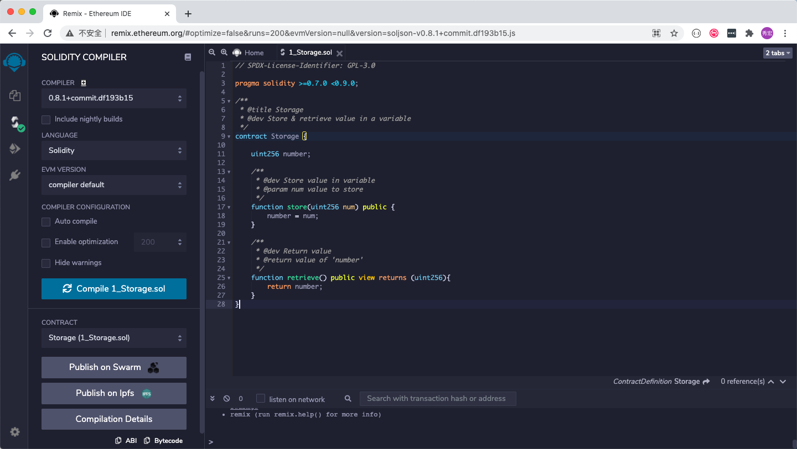

# Deploy contract using Remix

This article shows how to deploy smart contract using Remix IDE.

Step 1, open [Remix IDE](http://remix.ethereum.org/) in your browser:

Step 2, chose an environment. We can use MetaMask by selecting "Injected Web3" or connect to node directly by selecting "Web3 Provider". Take MetaMask for example, we neet to config it's network first:

Then, select "Injected Web3" to connect to MetaMask:

Step 3, create and compile your smart contract. We use Remix's Storage demo as example:

Compile your smart contract:

Step 4, deploy compiled smart contract by clicking "Deploy" button:

Click "OK" button on MetaMask popup window:

